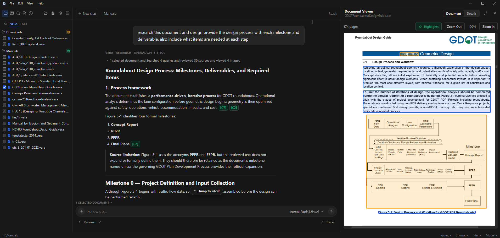
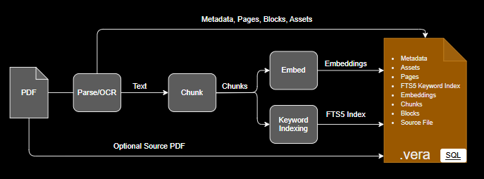
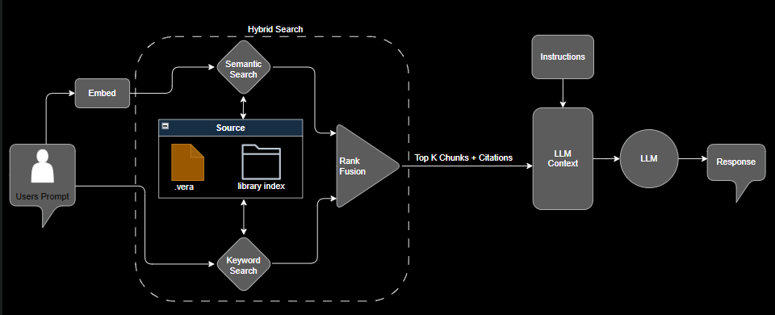

# .vera

[](https://github.com/dkylewillis/vera/actions/workflows/ci.yml)
[](https://github.com/dkylewillis/vera/releases/latest)
[](LICENSE)

**A different approach to RAG.**

**VERA** stands for **Vector-Embedded Retrieval Archive**. A `.vera` file is a
portable RAG archive: a self-contained SQLite file that packages the original
document with its extracted text, chunks, embeddings, keyword index, figures,
and citation metadata. Move it, share it, or search it locally—without
re-ingestion, a vector database, or a retrieval service.

The VERA desktop app helps people create, organize, search, and ask questions
over `.vera` archives. The CLI and MCP server give AI agents and applications
the same citation-ready retrieval layer.

[Download VERA for Windows](https://github.com/dkylewillis/vera/releases/latest)
· [Use VERA from the CLI or an AI agent](#for-cli-and-ai-agent-users)
· [Read the documentation](docs/README.md)




<!-- TODO(assets): 20–30s feature tour video — upload to a GitHub Release or
external host, then add: [Watch the feature tour](VIDEO_URL) -->

## Try it in five minutes

Converting and searching documents is fully local and needs no account or API
key. You only connect a model provider when you want AI answers.

1. **Install VERA.** Download the `VERA Setup` installer from the
   [latest Windows release](https://github.com/dkylewillis/vera/releases/latest)
   and run it.
2. **Convert your documents.**
   - **One PDF** — open **Convert PDF**, choose **Single PDF**, pick a PDF,
      and select **Convert**. VERA writes a portable `.vera` archive beside
      it.
   - **Entire library** — choose **PDF Directory** to batch-convert a folder
      of PDFs, then use **File > Open Folder** to activate it. On your first
      Search or Ask, VERA shows **Build library index?** — select
      **Build index** to make the library fast.
3. **Connect a model.** Go to **File > LLM Providers**, select a provider,
   paste your **API Key**, select **Save Key**, then **Save & Close**. Keys
   are stored encrypted on your machine. Local **Ollama** and **LM Studio**
   servers work too — no key needed.
4. **Search.** Open **Search** and query your documents. Hybrid retrieval
   (semantic + keyword) works entirely offline.
5. **Ask and verify.** Ask a question, then select a citation to see the
   highlighted supporting text in the source document.

<!-- TODO(assets): uncomment when captured — see docs/assets/readme/README.md


-->

The desktop app converts with local hashing embeddings; the model provider is
only used for Ask responses. Use the CLI when you need a Sentence Transformers
embedding model or explicit OCR control. For the complete walkthrough and
troubleshooting, see [Run the desktop app](docs/desktop-app-getting-started.md).

## How it works

During conversion, VERA extracts native PDF text, selectively OCRs image-based
pages, preserves headings, figures, and page coordinates, then stores chunks,
embeddings, and a keyword index in one validated `.vera` file:



At search time, hybrid retrieval fuses semantic and keyword rankings and
returns chunks with their source file, page range, and heading path — grounded
context for a person or an LLM, with no retrieval service required:



On a 1,038-page stormwater manual (2,442 chunks), hybrid search hits 9/10
real-world regulatory queries at MRR 0.900 — tracked continuously with
[`vera eval`](docs/evaluation.md).

## What VERA gives you

- **Portable document archives** — each `.vera` file is self-contained;
  copy it anywhere and it stays searchable.
- **Grounded answers** — follow citations to the page, heading, and
  highlighted source text.
- **Libraries that stay fast** — a persistent local index makes searching
  hundreds or even thousands of documents possible; update it as documents
  change.
- **Source-first review** — inspect pages and figures, validate archives, and
  export the original PDF back out at any time.

<!-- TODO(assets): uncomment when captured — see docs/assets/readme/README.md


-->

## For CLI and AI agent users

VERA also provides a CLI, Python library, MCP server, and portable Agent Skill
for workflows that need structured, citation-ready retrieval.

```bash
# Convert a PDF to a portable retrieval archive.
vera convert input.pdf output.vera

# Build a persistent local index for a document library.
vera index build ./library --recursive

# Return grounded results for an application or agent.
vera search ./library "What are the detention requirements?" --top-k 5 --json
```

The default hybrid search combines semantic and keyword retrieval. Every result
includes its source filename, page range, and heading path. Add
`--context-chunks`, `--figures`, or `--regions` when the agent needs nearby
text, figure metadata, or page coordinates.

- [CLI quick start and recipes](docs/getting-started.md)
- [CLI reference](docs/cli-reference.md)
- [Connect an MCP client](docs/mcp.md)
- [Install the VERA Agent Skill](docs/agent-skills.md)
- [Use the Python API](docs/python-api.md)
- [Agent quick reference](AGENTS.md)

## Documentation

- [Desktop app guide](docs/desktop-app-getting-started.md)
- [Convert documents](docs/conversion.md)
- [Search documents](docs/searching.md)
- [Search and index document libraries](docs/document-libraries.md)
- [Work with figures and source regions](docs/figures-and-regions.md)
- [Troubleshooting](docs/troubleshooting.md)
- [VERA format specification](docs/vera-spec-v0.1.md)
- [Contributing and architecture](docs/architecture.md)

## Status and support

VERA is an experimental v0.1 project. The desktop installer is available from
[GitHub Releases](https://github.com/dkylewillis/vera/releases) and currently
targets Windows. The `.vera` schema and format may change before a stable
release.

VERA is licensed under [Apache-2.0](LICENSE).
