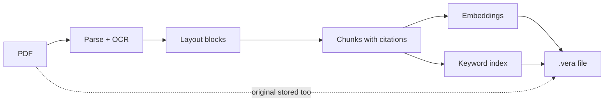
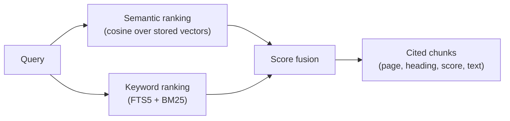

# VERA — Vector-Embedded Retrieval Archive

[](https://github.com/dkylewillis/vera/releases/latest)
[](https://pypi.org/project/vera-doc/)
[](LICENSE)

**Convert once. Search anywhere.**

A `.vera` file is a portable embedded vector database: one self-contained
SQLite file holding ready-made text chunks, pre-computed embeddings, a keyword
index, citation metadata, and the original source document. Copy it, share it,
or hand it to an LLM agent — it stays semantically searchable with no vector
database, no embedding service, and no retrieval server.

```bash
pip install vera-cli
vera convert manual.pdf manual.vera
vera search manual.vera "when is stormwater detention required?" --json
```

## The vision

Every application that wants semantic search over documents rebuilds the same
pipeline — and every copy of that pipeline needs infrastructure:

```text
Today                                   VERA
─────                                   ────
Source document                         Source document
    ↓                                       ↓
Parse ──┐                               Convert once
Chunk   │  repeated per app,                ↓
Embed   │  requires a running           .vera file
Index   │  vector database                  ↓
    ↓ ──┘                               Search anywhere —
Search                                  any machine, any app, any agent
```

VERA moves the expensive work into the file. A PDF preserves how a document
*looks*; a `.vera` preserves what it *means* — the document plus a complete
retrieval layer. Conversion happens once, then any compatible application can
open the archive and run semantic, keyword, or hybrid search locally, offline,
with citation-ready results that point back to the exact page and heading.

The core motivation is AI agents: an agent should be able to semantically
search a document the moment it receives one — no parsing step, no chunking
strategy decisions, no embedding API calls, no vector database to stand up.
With VERA, "set up retrieval" collapses into "open the file."

## Getting started

Install the CLI (Python 3.10+). It bundles storage, the default PDF pipeline,
and offline OCR data:

```bash
python -m pip install "vera-cli>=0.2.4"
```

Convert a PDF and start asking questions:

```bash
# Parse, OCR (if needed), chunk, embed, and index — one validated output file
vera convert manual.pdf manual.vera

# Hybrid search (semantic + keyword), citation-ready results
vera search manual.vera "stormwater detention requirements" --top-k 5

# What's inside?
vera inspect manual.vera

# Structurally sound?  exit 0 = valid
vera validate manual.vera

# Get the original PDF back out
vera export manual.vera exported.pdf
```

The default embedding model is a deterministic local hashing embedder — no
downloads, no API keys, fully offline. For stronger neural retrieval, install
Sentence Transformers support and pick a model at convert time:

```bash
python -m pip install "vera-doc[ml]"
vera convert manual.pdf --model sentence-transformers:all-MiniLM-L6-v2
```

See the [getting started guide](docs/getting-started.md) for the full
walkthrough and [CLI recipes](docs/examples.md) for more patterns.

## What it can do (via CLI)

Every one-shot command accepts `--json` for machine-readable output, which
makes the whole surface scriptable by agents and applications:

| Command | What it does |
|---------|--------------|
| `vera convert` | Convert a PDF (or a whole directory) into `.vera` archives, with selective OCR |
| `vera search` | Hybrid, semantic, or keyword search over a file or a folder-as-corpus |
| `vera index` | Build, update, and check a persistent library index over many archives |
| `vera inspect` | Report pages, chunks, embedding model, parser, and archive metadata |
| `vera validate` | Verify schema, hashes, embeddings, and index integrity |
| `vera export` | Recover the original source document from the archive |
| `vera eval` | Score retrieval quality against a query set (hit rate, MRR) |
| `vera ocr-languages` | List or fetch Tesseract OCR language data |
| `vera mcp` | Serve everything above to AI agents over MCP (stdio) |

A few useful compositions:

```bash
# Search a folder of .vera files as one corpus (results carry a "file" field)
vera search ./library "landscape buffer requirements" --top-k 5 --json

# Make large libraries fast with a persistent, rebuildable index
vera index build ./library --recursive
vera index update ./library

# Pull in neighboring prose, figure metadata, or page-coordinate highlights
vera search manual.vera "pipe sizing chart" --json --context-chunks 1 --figures --regions

# Exact phrases and section numbers → keyword; paraphrased questions → semantic
vera search manual.vera "section 4.2" --mode keyword
vera search manual.vera "how big should the pond be" --mode semantic

# Batch-convert a nested PDF library, then track retrieval quality
vera convert ./proposals --recursive --json
vera eval manual.vera queries.json --mode all --top-k 5 --json
```

Every search result is citation-ready:

```json
{
  "chunk_id": "chunk_0042",
  "score": 0.91,
  "text": "Detention is required when the proposed development increases...",
  "page_start": 117,
  "page_end": 118,
  "heading_path": "Chapter 4 > 4.2 Detention Design",
  "source_filename": "manual.pdf"
}
```

On a 1,038-page stormwater manual (2,442 chunks), hybrid search hits 9/10
real-world regulatory queries at MRR 0.900 — tracked continuously with
[`vera eval`](docs/evaluation.md).

## Built for AI agents

Three integration surfaces, one retrieval engine:

- **CLI with `--json`** — any agent that can run shell commands can convert,
  search, inspect, and validate archives. This repository's own
  [AGENTS.md](AGENTS.md) teaches coding agents the workflow.
- **MCP server** — `vera mcp` exposes `vera_search`, `vera_corpus_search`,
  `vera_inspect`, `vera_validate`, `vera_figures`, `vera_get_page`, and
  `vera_get_chunk_regions` as tools over stdio. Works with any MCP client;
  see [Connect an MCP client](docs/mcp.md).
- **Agent Skill** — a portable [SKILL.md](skills/vera/SKILL.md) package with a
  complete [CLI reference](skills/vera/references/cli-reference.md) that drops
  into Agent-Skills-compatible tools (Cursor and others). See
  [Install the VERA Agent Skill](docs/agent-skills.md).

The retrieval contract is the same everywhere: results always carry the source
filename, page range, and heading path, so agents can quote *"(p. 117,
Chapter 4 > 4.2 Detention Design)"* instead of hallucinating a citation.
Optional `--regions` output adds page numbers and bounding boxes so a viewer
can highlight exactly where an answer came from.

## How it works

**Conversion** runs the expensive pipeline exactly once, in five steps:

1. **Parse.** The ingest pipeline extracts text and layout from every page,
   selectively OCRing image-based pages that have little or no native text.
2. **Structure.** Each page is decomposed into typed layout blocks — headings,
   paragraphs, tables, captions, and images — each with a page number and
   bounding box.
3. **Chunk.** Blocks are assembled into heading-aware chunks that keep their
   provenance: source filename, page range, heading path, and the regions
   they came from.
4. **Embed and index.** Every chunk gets one vector from the chosen embedding
   model and one row in the FTS5 keyword index.
5. **Package.** Chunks, embeddings, the keyword index, figures, page geometry,
   archive metadata, and the original PDF are written into a single SQLite
   file, validated, and published atomically.



**Search** never repeats any of that work. A query runs both retrieval paths
against the local file and fuses them:

1. The query is embedded with the same model recorded in the archive and
   scored against the stored vectors by cosine similarity.
2. The same query runs through the FTS5 keyword index, ranked with BM25.
3. Both rankings are min-max normalized and combined with equal weight
   (`--mode semantic` or `--mode keyword` uses just one path).
4. The top chunks come back with their score, text, source filename, page
   range, and heading path — ready to cite.



Both paths read plain SQLite — a search is just opening a file.

## Inside a `.vera` file

A `.vera` file is a plain SQLite 3 database with a standardized schema, fully
specified in [the format spec](docs/vera-spec-v0.2.md). You can open one with
any SQLite tool, though the CLI and Python API are the stable interface.

### What each table stores

| Table | Contents |
|-------|----------|
| `vera_metadata` | Format name/version, creator, embedding model, dimension, and normalization policy, plus a caller-owned `archive_metadata` JSON object (source filename and hash, parser identity, OCR diagnostics, page counts) |
| `chunks` | The only searchable unit: final chunk text plus `metadata_json` carrying `source_filename`, `page_start`/`page_end`, `heading_path`, and highlight `regions` |
| `embeddings` | Exactly one vector per chunk — little-endian float32, with the model name and dimension that produced it |
| `chunks_fts` | SQLite FTS5 full-text index over chunk text, ranked with BM25 |
| `attachments` | Opaque, SHA-256-hashed blobs: the original PDF, extracted figure images, and JSON viewer payloads for page and block geometry |
| `chunk_attachments` | Links chunks to attachments with a semantic `role` (`"source"`, `"figure"`) |

The archive is honest about its own provenance: it records which parser,
chunking strategy, and embedding model were used, and whether stored vectors
are L2-normalized. `vera validate` checks all of it — schema, hashes, vector
dimensions, and index consistency.

### Blocks: how VERA understands document structure

During conversion, ingest pipelines decompose each page into normalized
**layout blocks**. Every block has a stable ID, a page number, a bounding box
in page points (origin top-left), and one of five types:

| `block_type` | What it is | How VERA uses it |
|--------------|------------|------------------|
| `heading` | Section titles, with detected heading level | Starts new chunks and builds the `heading_path` breadcrumb every citation carries |
| `paragraph` | Body text | The main content of chunks; its bbox becomes a highlight region |
| `table` | Detected tables, exported as markdown | Searchable as chunk text, so table contents show up in results |
| `caption` | Text adjacent to a figure | Joined to figures so search can return captioned figure metadata |
| `image` | Extracted figures, charts, and drawings | Stored as figure attachments with page and bbox — surfaced via `--figures`, never embedded as text |

Chunks remember which blocks they came from. That provenance chain — chunk →
blocks → page + bounding boxes — is what lets `--regions` return exact
highlight rectangles and lets viewers draw an answer directly onto the source
page. The full mapping of blocks, figures, and regions onto the storage schema
is documented in [Figures and highlight regions](docs/figures-and-regions.md).

### Libraries of archives

A folder of `.vera` files is already a corpus — `vera search ./library ...`
searches them together and attributes each result to its file. For large
collections, `vera index build` creates a persistent `.vera-index/` beside the
archives. The index is derived and rebuildable: individual `.vera` files
remain the source of truth, and the index can be discarded and rebuilt at any
time. See [document libraries](docs/document-libraries.md) and the
[index structure](docs/library-index-structure.md).

## Plugins

VERA avoids lock-in by design: the format does not depend on one parser or one
embedding provider. Both are pluggable through standard Python entry points.

### Ingest pipelines (`vera.ingest_pipelines`)

A pipeline is any callable `(source_path, IngestRequest) -> IngestResult` that
turns a source document into normalized pages, blocks, and chunks. Pipelines
are selected by `provider[:variant]` spec and configured with provider-owned
options:

```bash
vera convert manual.pdf --parser pymupdf --pipeline-option chunk_size=700
vera convert manual.pdf --parser docling:hybrid   # requires vera-ingest-docling
```

Two pipelines ship today:

- **`pymupdf`** (default, via `vera-ingest-pymupdf`) — PyMuPDF + pdfplumber
  parsing, table extraction, heading detection, and selective Tesseract OCR
  with bundled English data. Installed automatically with the CLI and app.
- **`docling`** (optional, via `vera-ingest-docling`) — Docling layout models
  and HybridChunker with contextualized embedding text.

Registering your own is a decorator away:

```python
from vera_ingest import register_ingest_pipeline

@register_ingest_pipeline("myformat")
def create_pipeline(variant: str = ""):
    def ingest(source_path, request):
        ...  # return an IngestResult with pages, blocks, and chunks
    return ingest
```

Distribute it as a package with a `vera.ingest_pipelines` entry point and
`vera convert --parser myformat` finds it automatically. Pipelines can also
publish descriptors that advertise their options for schema-driven UIs. See
[Creating an ingest pipeline](docs/creating-an-ingest-pipeline.md).

### Embedding providers (`vera.embedders`)

Embedding models are resolved from `provider:model-id` specs through the same
registry pattern:

```bash
vera convert manual.pdf --model hashing                                     # default: offline, deterministic
vera convert manual.pdf --model sentence-transformers:all-MiniLM-L6-v2     # local neural model
vera convert manual.pdf --model hashing --embedder-option dimension=256    # provider-owned options
```

Built-in providers are `hashing` (deterministic lexical hashing — portable,
zero dependencies, no network) and `sentence-transformers` (local neural
embeddings via the `ml` extra). Third-party providers register through the
`vera.embedders` entry-point group or `register_embedder()`, and can advertise
option schemas, model presets, and required credential environment variables
so hosts can preflight them without secrets in config. Unknown model names are
rejected loudly — VERA never silently substitutes a different embedder,
because the archive records exactly which model must answer queries. See
[Creating an embedding provider](docs/creating-an-embedding-provider.md).

## The packages

VERA is a mono-repo of independently installable packages with strict one-way
dependencies pointing at the storage engine:

```text
vera-ingest-pymupdf ──> vera-ingest ─┐
vera-ingest-docling ──> vera-ingest ─┤
vera-cli ────────────────────────────┼──> vera-doc
vera-app ────────────────────────────┤
vera-mcp ────────────────────────────┘
```

| Package | Import / command | What it owns |
|---------|------------------|--------------|
| [`vera-doc`](https://pypi.org/project/vera-doc/) | `import vera` | The core: `.vera` schema and validation, transactional chunk/attachment CRUD, embedding storage, and keyword/semantic/hybrid/corpus search. Knows nothing about PDFs. |
| [`vera-ingest`](https://pypi.org/project/vera-ingest/) | `import vera_ingest` | Provider-neutral conversion: the pipeline registry, shared block/chunk types, chunking helpers, atomic archive writing, and viewer helpers for pages, figures, and regions |
| [`vera-ingest-pymupdf`](https://pypi.org/project/vera-ingest-pymupdf/) | plugin | Default PDF pipeline: PyMuPDF/pdfplumber parsing, table extraction, selective OCR |
| [`vera-ingest-docling`](https://pypi.org/project/vera-ingest-docling/) | plugin | Optional Docling pipeline with layout models and hybrid chunking |
| [`vera-cli`](https://pypi.org/project/vera-cli/) | `vera` | The command line: argument parsing, text/JSON output contracts, exit codes, and retrieval evaluation |
| [`vera-mcp`](https://pypi.org/project/vera-mcp/) | `vera mcp` | Thin MCP adapter exposing search, inspection, figures, pages, and regions as agent tools |
| `vera-app` | — | Electron/React desktop app with a Python sidecar — a full product built on the same stack |

The boundary that matters most: `vera-doc` never imports extraction, UI, MCP,
or evaluation code. It is an embedded vector database that happens to be
excellent at documents — attachments are opaque bytes and metadata is caller
data. Everything else composes around it. Details in
[Contributing and architecture](docs/architecture.md) and the
[package overview](packages/README.md).

**Who installs what**

- Agents and scripts → `vera-cli` (optionally `vera-cli[mcp]`)
- Apps with ready-made chunks → `vera-doc` only
- PDF conversion in your own app → `vera-doc` + `vera-ingest` + `vera-ingest-pymupdf`
- End users who want a GUI → the [desktop app](https://github.com/dkylewillis/vera/releases/latest)

## Use VERA as a Python library

Applications that already have chunks need only `vera-doc` — no PDF or ML
dependencies:

```python
from vera import ChunkRecord, VeraDocument

with VeraDocument.create("knowledge.vera") as document:
    document.add([
        ChunkRecord(
            id="chunk-1",
            text="The minimum pipe diameter is 12 inches.",
            metadata={"source": "manual.pdf", "page": 42},
        )
    ])

with VeraDocument.open("knowledge.vera") as document:
    results = document.search(text="minimum pipe size", top_k=5)
```

Full document conversion is one import away:

```python
from vera_ingest import convert

convert("manual.pdf", "manual.vera")
```

See the [Python API guide](docs/python-api.md) for attachments, metadata
filters, corpus search, and embedding configuration.

## Design principles

1. **Convert once, search anywhere.** The archive contains everything needed
   to search it — the ingestion pipeline never has to run twice.
2. **Preserve source truth.** The original document rides along inside the
   archive, and every result points back to its page, heading, and region.
3. **Be transparent.** The file declares its parser, chunking strategy,
   embedding model, and normalization policy. `vera validate` holds it to that.
4. **Avoid lock-in.** SQLite container, documented schema, pluggable parsers
   and embedders — no dependence on any one vendor, model, or database.
5. **Be useful before it is perfect.** A working local search file beats a
   perfect design that never ships.

## Desktop app

VERA also ships a desktop application for Windows — convert PDFs from the
right-click menu, search libraries with highlighted citations, and connect an
LLM provider for grounded Ask answers over your documents. Download it from
[GitHub Releases](https://github.com/dkylewillis/vera/releases/latest) and see
the [desktop app guide](docs/desktop-app-getting-started.md). It is built
entirely on the packages above — a demonstration that the archive, not the
app, is the product.

## Documentation

Preview the documentation locally with `uv run --extra docs mkdocs serve`, or
browse the [published docs](https://dkylewillis.github.io/vera/).

- [Getting started (CLI)](docs/getting-started.md) · [CLI reference](docs/cli-reference.md) · [CLI recipes](docs/examples.md)
- [Convert documents](docs/conversion.md) · [Search documents](docs/searching.md) · [Document libraries](docs/document-libraries.md)
- [Figures and highlight regions](docs/figures-and-regions.md) · [Validation and export](docs/validation-and-export.md) · [Evaluation](docs/evaluation.md)
- [Python API](docs/python-api.md) · [MCP integration](docs/mcp.md) · [Agent skills](docs/agent-skills.md) · [Agent quick reference](AGENTS.md)
- [Creating an ingest pipeline](docs/creating-an-ingest-pipeline.md) · [Creating an embedding provider](docs/creating-an-embedding-provider.md)
- [Format spec 0.2 (current)](docs/vera-spec-v0.2.md) · [Format spec 0.1 (legacy)](docs/vera-spec-v0.1.md)
- [Architecture and contributing](docs/architecture.md) · [Roadmap](ROADMAP.md) · [Troubleshooting](docs/troubleshooting.md)

## Status and support

VERA is an experimental pre-1.0 project. The `.vera` schema and format may
change before a stable release — see the [roadmap](ROADMAP.md) for what's
planned. The desktop installer currently targets Windows and is available from
[GitHub Releases](https://github.com/dkylewillis/vera/releases).

VERA is licensed under [Apache-2.0](LICENSE).
