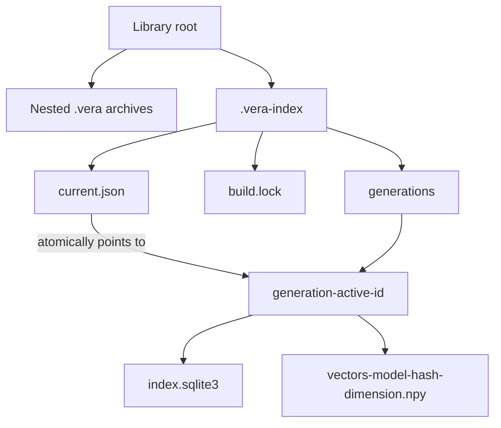
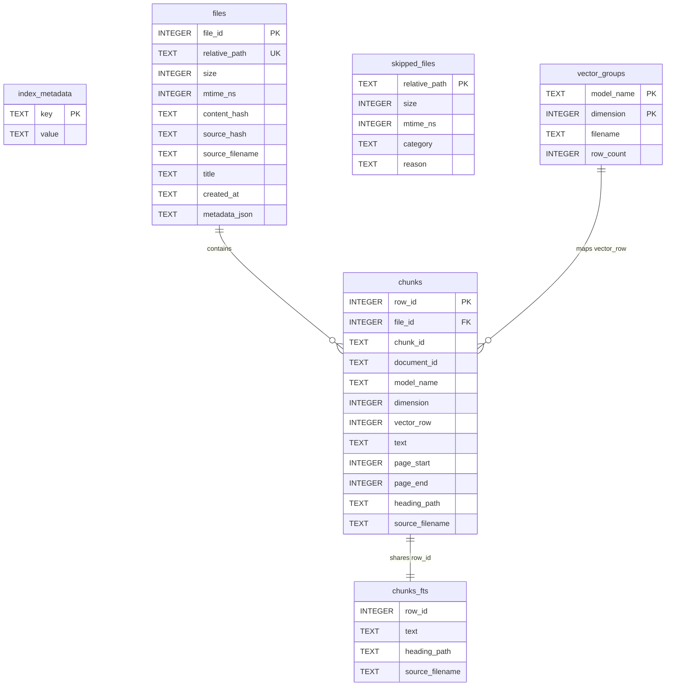
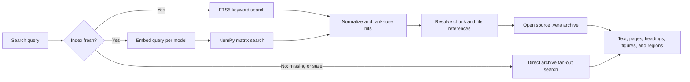

# Library index structure

A VERA library keeps each document in its own portable `.vera` archive. The
optional `.vera-index` directory is a disposable acceleration layer: it
duplicates enough metadata, keyword text, and vectors to search the library
efficiently, but the archives remain the source of truth.

## On-disk layout

`current.json` identifies the active generation. A build writes and validates a
new generation before atomically replacing that pointer under `build.lock`.
After the swap, VERA deletes every other generation directory. Concurrent
readers that already opened the previous generation can finish the pointer
swap; leftover files are best-effort cleanup, not a retained history.

## Active generation contents

The relationships from `chunks` to `chunks_fts` and `vector_groups` are logical
rather than SQLite foreign keys:

- `chunks_fts.row_id` connects a keyword hit to its chunk.
- `(model_name, dimension)` selects a vector-group manifest.
- `chunks.vector_row` selects that chunk's row in the group's NumPy matrix.
- `chunks.file_id` resolves the hit to a root-relative `.vera` path in `files`.

## Indexed search path

The index accelerates candidate retrieval. Complete source text, citation
geometry, figures, and the original document continue to come from the selected
`.vera` archives. See [VERA collection indexes](collection-index.md) for build,
update, freshness, fallback, and performance behavior.
